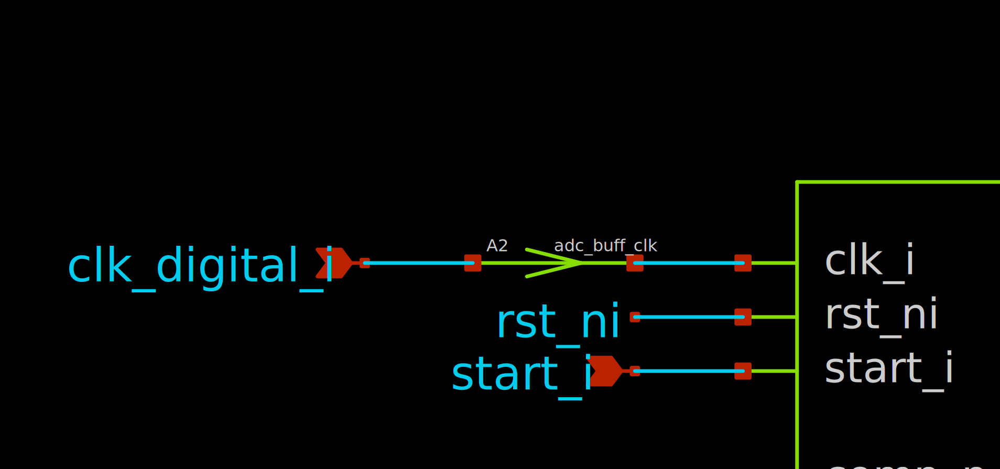

## What are bridges?

Bridges in ngspice define the transitions between the analog and digital domain. There are three different types of bridges:

| Bridge Type   | Purpose           | Description                                                     |
| ------------- | ----------------- | --------------------------------------------------------------- |
| `dac_bridge`  | Digital-to-Analog | Node bridge at outputs of digital blocks                        |
| `adc_bridge`  | Analog-to-Digital | Node bridge at inputs of digital blocks                         |
| `bidi_bridge` | Bidirectional     | Allows two-way communication between analog and digital domains |

These bridges have a variety of configurable parameters, such as trigger voltage levels, rise/fall times and delays.

## Automatically placed Bridges

By default, ngspice inserts some bridges automatically between analog and digital domains based on the circuit topology. The default bridges are:

- Digital-to-Analog: `.model auto_dac dac_bridge(out_low = 0 out_high = 'VCC')`
- Analog-to-Digital: `.model auto_adc adc_bridge(in_low = 'VCC/2' in_high = 'VCC/2')`
- Bidirectional: `.model auto_bidi bidi_bridge(out_high='VCC' in_low='VCC/2' in_high='VCC/2')`

But they can be overwritten. I suggest using bidirectional bridges for all of them, since they have the most flexible parameters. You can change the default bridges as follows:
```spice
.model adc_buff_clk adc_bridge(in_low = 'vdd/2' in_high = 'vdd/2')

.control
.model adc_buff_clk adc_bridge(in_low='vdd/2' in_high='vdd/2')

.control
pre_set auto_bridge_d_out =
+ ( \".model auto_bridge_out bidi_bridge(direction=0 out_high='vdd' t_rise=0.2n t_fall=0.2n)\"
+   \"auto_bridge_out%d [ %s ] [ %s ] null auto_bridge_out\" )
pre_set auto_bridge_d_in =
+ ( \".model auto_bridge_in bidi_bridge(direction=1 in_low='vdd/3' in_high='vdd/3*2')\"
+   \"auto_bridge_in%d [ %s ] [ %s ] null auto_bridge_in\" )
.endc
```
This defines the following models:

- `auto_bridge_out`: A bidirectional bridge for analog-to-digital conversion.
- `auto_bridge_in`: A bidirectional bridge for digital-to-analog conversion.
- `adc_buff_clk`: A bridge for clock signals in ADCs. If you have a hysteresis on the digital inputs, your signal may be undefined for some duration of the clock edge. Since one may not want this behavior in their clock inputs, we define a bridge model specifically for clock inputs.

## Manually placing Bridges

Bridges can also be placed manually. The components for the bridges are located in the generic library and are called `adc_bridge.sym` and `dac_bridge.sym`.

We can take our clock buffer above as an example. Place the `adc_bridge.sym` directly in front of the clock pin of a digital design. Double-click on the bridge and change the model from `adc_buff` to `adc_buff_clk`. Now, the clock input should use the properties as described in the `adc_buff_clk` model.
