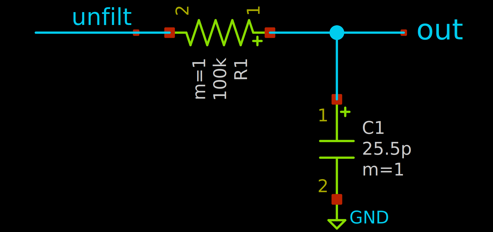
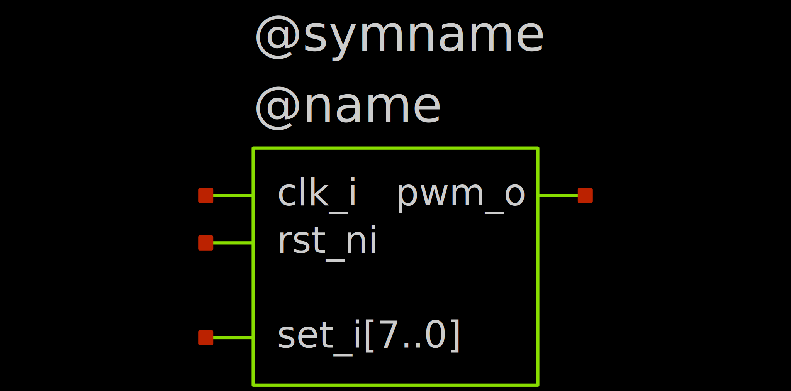
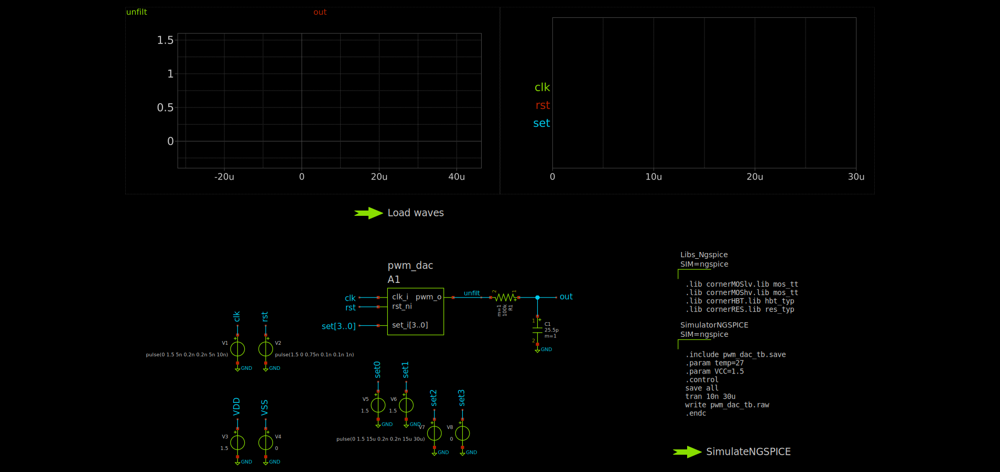
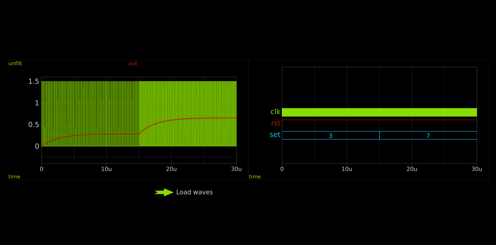

To get a full mixed-signal simulation, we need:

- Digital design, we write it in SystemVerilog
- Analog design, in SPICE, designed in XSCHEM
- A symbol representing the digital design as a block for XSCHEM
- Testbench, combining both Analog and Digital designs and defining their interaction

In our example, we create a simple PWM DAC, with digitally adjustable output voltage levels.

## Digital Design

We create a simple SystemVerilog module with the following signals:

| Signal Name  | Direction | Function                                |
| ------------ | --------- | --------------------------------------- |
| `clk_i`      | Input     | Clock signal                            |
| `rst_ni`     | Input     | Active-low reset signal                 |
| `set_i[3:0]` | Input     | 4-bit control signal for the duty cycle |
| `pwm_o`      | Output    | PWM output signal                       |

The module might look something like this:
```sv
`timescale 1ns/1ps // (1)!

module pwm_dac (
    input logic       clk_i,  // Clock signal
    input logic       rst_ni, // Active-low reset signal
    input logic [3:0] set_i,  // 4-bit control signal for the duty cycle

    output logic      pwm_o   // PWM output signal
);

    logic [3:0] counter_d, counter_q;

    initial begin
        $display("PWM DAC digital part started"); // (2)!
        $dumpfile("pwm_dac.vcd"); // (3)!
        $dumpvars(0, pwm_dac);
    end

    always_ff @(posedge clk_i or negedge rst_ni) begin
        if (!rst_ni) begin
            counter_q <= '0;
        end else begin
            counter_q <= counter_d;
        end
    end

    always_comb begin
        if (!rst_ni) begin
            counter_d = '0;
        end else begin
            counter_d = counter_q + 1;
        end
    end

    assign pwm_o = (counter_q < set_i) ? 1'b1 : 1'b0;

endmodule
```

1.  **Important:** The ``timescale` directive is crucial for enabling cosimulation.
2.  This will get printed in the ngspice simulation log
3.  We can save the waveform data to a file for later analysis.

!!! danger
    The ``timescale` directive is crucial for enabling cosimulation. It has to be present in the top-level module used for cosimulation.

We save this code as `pwm_dac.sv` and compile it with Icarus Verilog. This is done with the following command:
```bash
iverilog -g2012 -o pwm_dac pwm_dac.sv
```
The `-g2012` flag tells Icarus Verilog to use the SystemVerilog 2012 standard.

This gives us a compiled simulation model that we can use for testing. You can actually open the resulting `pwm_dac` file with your text editor and see that it's a script for the `vvp` tool.

## Analog Design

We design a simple 1-stage RC lowpass filter. We assume the input frequency to be $100\ MHz$. The resulting output frequency is thus $\frac{100\ MHz}{16} = 6.25\ MHz$. We put the corner frequency of the filter two decades lower, at $62.5\ kHz$. With $R = 100\ k\Omega$, we need $C = \frac{1}{2\pi f_c R} \approx 25.5\ pF$.

We implement the circuit in the testbench `pwm_dac_tb.sch` directly via
```bash
xschem pwm_dac_tb.sch
```

??? info "The resulting circuit looks something like this"
    

## Symbol for the Digital Design

We need to create a symbol for the digital design that we can use in the testbench. This symbol should represent the inputs and outputs of the `pwm_dac` module. Create a new symbol with
```bash
xschem pwm_dac.sym
```
Directly after opening, please save the symbol via `File -> Save as symbol` (or `Ctrl + Alt + S`). This ensures that the symbol properties are properly setup.

Now, we first configure these properties by double-clicking the emtpy canvas. This opens an empty text input where we enter:
```
type=primitive
format="@name [ @@clk_i @@rst_ni @@set_i[3..0] ] [ @@pwm_o ] @model"
template="name=A1 model=pwm_dac device_model=\".model pwm_dac d_cosim simulation=\\\"ivlng\\\" sim_args=[\\\"pwm_dac\\\"]\""
```
This defines:

- The type of the symbol (`primitive`, other options include `subcircuit` for actual circuits)
- The format of the circuit. This has to be very specific:
    1. `@name`: The name of the instance in the schematic (e.g., `A1`)
    2. `[ @@clk_i @@rst_ni @@set_i[3..0] ]`: The input ports of the instance
    3. `[ @@pwm_o ]`: The output ports of the instance
    4. `@model`: The model name of the instance (e.g., `pwm_dac`)
- The template for the instance. This defines how the instance will be instantiated in the schematic. 
    1. `A1`: The name template the block will use in the schematic.
    2. `pwm_dac`: The cosimulation model this block uses.
    3. `device_model`: The device model for the block, including the simulation command/arguments.

!!! warning
    The spaces in the input/output ports list are significant and **must be preserved**.

    This is invalid and will not work:
    ```
    @name [@@clk_i @@rst_ni @@set_i[3..0]] [@@pwm_o] @model
    ```
    This will:
    ```
    @name [ @@clk_i @@rst_ni @@set_i[3..0] ] [ @@pwm_o ] @model
    ```

    **Also**, the order of the ports in each list must match the definition in the verilog module.

Now, we place the pins of the symbol in the schematic. Do this via `Symbol -> Place symbol pin` (`Alt + P`). Make sure to set the correct name and direction (`in`, `out` or `inout`) for each pin.

??? info "The resulting symbol might look something like this"
    
    The `@symname` and `@name` texts are placeholders that will be replaced with the actual symbol and instance names when the schematic is instantiated. You can leave them out.


I have written a small web tool to generate XSCHEM symbols from (System)Verilog modules. You can access it here:

[XSCHEM Symbol Generator](./symbol_gen.html){ .md-button }

[YOSYS Online Playground](./yosys_online.html){ .md-button }

## Testbench

Now, we go back to the testbench
```bash
xschem pwm_dac_tb.sch
```

Place our `pwm_dac.sym` symbol into the schematic. Now, we need to specify the cosimulation model for the PWM DAC. We can do this in this symbols properties directly. When you open the symbols properties by double-clicking it, you should be able to see the name and model properties. On a new line, add the following:
```spice
device_model=".model pwm_dac d_cosim simulation=\"ivlng\" sim_args=[\"../pwm_dac\"]"
```
The `device_model` property specifies the model name and the simulation parameters for the PWM DAC. This tells ngspice to use the `ivlng` simulation method with the specified arguments.

Now we can hook up the output up to the lowpass filter. Also place voltage sources to input the clock and reset signals, as well as the control inputs. Single signals from a bus can be accessed via the `a0 up to a3` labels if you have a `a[3..0]` label.

The control inputs `set_i0 to set_i3` are each connected to their own voltage source so that we can simulate a simple changing digital input. A simple example would be the following:

| Signal   | Description                                 |
| -------- | ------------------------------------------- |
| `set_i0` | Logic high (bit 0)                          |
| `set_i1` | Logic high (bit 1)                          |
| `set_i2` | Transition from low to high at 15μs (bit 2) |
| `set_i3` | Logic low (bit 3)                           |

With this, we simulate a simple step from input code 0x03 to 0x07 at 15us, such that we can observe the behavior of the PWM DAC.

Add the device models and simulation commands/launcher. For the simulation commands, we use the following:
```spice
.include pwm_dac_tb.save
.param temp=27
.param VCC=1.5
.control
save all
tran 10n 10u
write pwm_dac_tb.raw
```
Here, the important part is `VCC`. This defines the logic levels for the digital->analog and analog->digital bridges. These bridges can be set up more sophisticated (See [Bridges](bridges.md)), but for now we just set `VCC` to our vdd, 1.5V. Also, we set the simulation time to 10 microseconds with a timestep of 10 nanoseconds and to save all data to `pwm_dac_tb.raw`.

Also add a waveform loader and two graphs.

??? info "The resulting testbench might look something like this"
    

## Simulation

!!! warning
    Make sure you set up XSCHEM as described in the [XSCHEM Setup](../setup/xschem.md) documentation. This is crucial for enabling cosimulation with ngspice.

We can then run the simulation with the simulation launcher. You should see such an output:
```log
******
** ngspice-44.2 : Circuit level simulation program
** Compiled with KLU Direct Linear Solver
** The U. C. Berkeley CAD Group
** Copyright 1985-1994, Regents of the University of California.
** Copyright 2001-2024, The ngspice team.
** Please get your ngspice manual from https://ngspice.sourceforge.io/docs.html
** Please file your bug-reports at http://ngspice.sourceforge.net/bugrep.html
** Creation Date: Tue Jul 29 08:21:22 UTC 2025
******

Note: No compatibility mode selected!

Circuit: ** sch_path: /workspaces/oscic-playground/cosim/pwm_dac_tb.sch

Note: No compatibility mode selected!

Reducing trtol to 1 for xspice 'A' devices
Doing analysis at TEMP = 27.000000 and TNOM = 27.000000

Using SPARSE 1.3 as Direct Linear Solver

Initial Transient Solution
--------------------------

Node                      Voltage
----                      -------
out                       0
unfilt                    0
clk                       0
rst                       1.5
vdd                       1.5
vss                       0
set0                      1.5
set1                      1.5
set2                      1.5
set3                      0
v#branch                  0
v7#branch                 0
v6#branch                 0
v5#branch                 0
v4#branch                 0
v3#branch                 0
v2#branch                 0
v1#branch                 0
auto_dac#branch_1_0       0

PWM DAC digital part started
VCD info: dumpfile pwm_dac.vcd opened for output.
 Reference value 9_95157e-06
No. of Data Rows : 205255
binary raw file "pwm_dac_tb.raw"
ngspice 1 ->
```
You can see the `PWM DAC digital part started` and `VCD info: dumpfile pwm_dac.vcd opened for output.` which indicate that the digital part of the simulation is running properly!

## Visualization

XSCHEM's built in graphs already include a handy way to display digital and analog signals concurrently. We use one of our graphs for the digital signals and one for the analog signals.

In the graph for the analog signals, add the `unfilt` and `out` signals. The settings can remain the default.

In the graph for the digital signals, add the `clk`, `rst` signals as well as `set;set3,set2,set1,set0`, which allows us to look at the `set` signals as a bus.

??? info "The resulting plots might look something like this"
    

!!! success
    We can see that our simple PWM DAC example works as expected.

!!! tip
    Now, you can also open the .vcd file in a waveform viewer to inspect the digital part more closely.