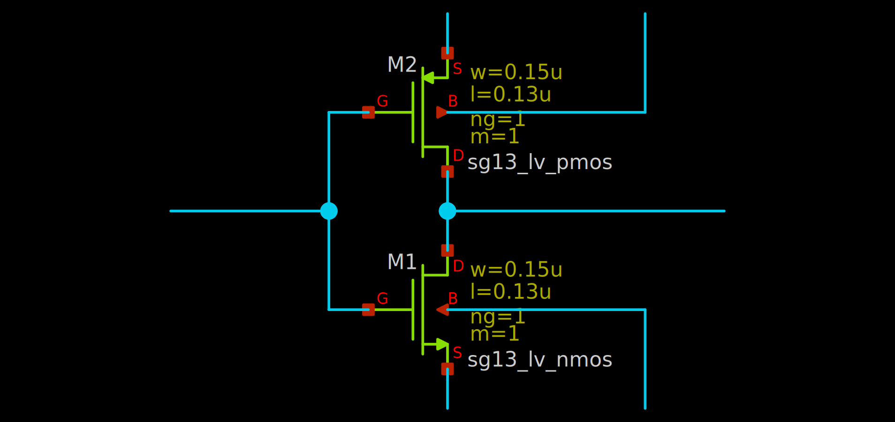
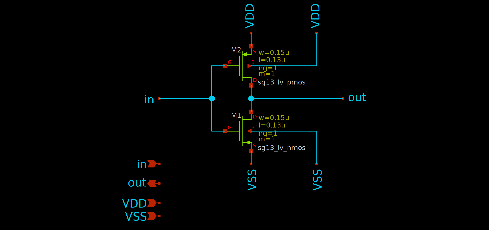
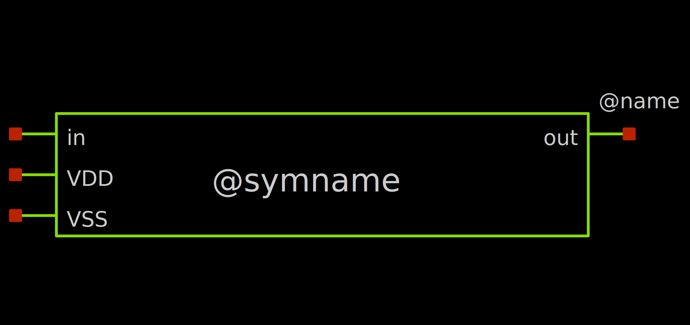
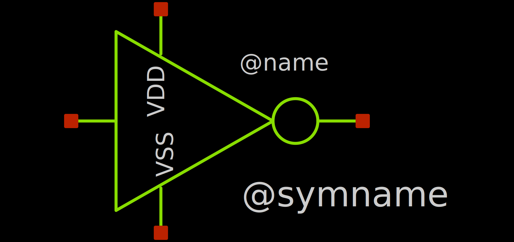
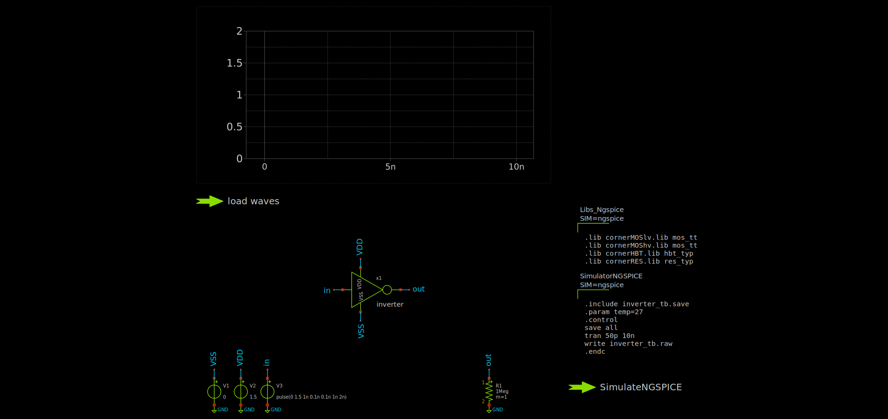
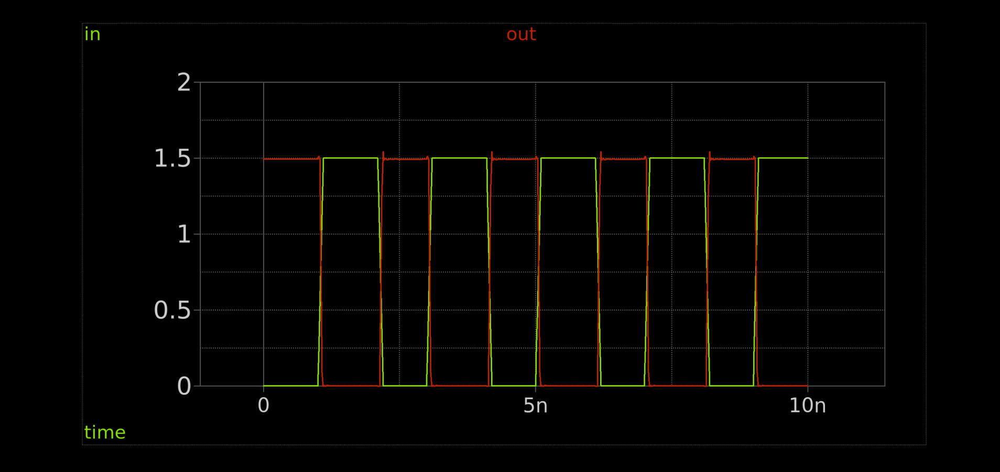

## Creating a new Block

Here, we will create our own inverter design, including a sub-sheet, symbol and testbench.

### Creating the Schematic

To create a new schematic in XSCHEM, we simply create a new `.sch` file (schematic format for XSCHEM). We can do this via
```bash
xschem inverter.sch
```

!!! info
    You will get a warning that the file does not exist, which is fine.

Now, you should see a blank schematic editor window where you can start building your inverter design.

**Symbols**

We start by placing our two MOSFETs (NMOS and PMOS) in the schematic. To do this, select the `Insert Symbol` symbol from the toolbar (looks like an AND gate) or press `Insert` on your keyboard.

This will open the `Choose symbol` dialog, where we can see some libraries. In our case, we choose the one ending with `ihp-sg13g2/libs.tech/xschem`. There, we choose `sg23g2_pr` and `sg13_lv_nmos`. Click `OK` to insert the symbol into the schematic. Place the symbol by moving it somewhere sensible and by then left-clicking to confirm the placement.

Repeat this for the PMOS transistor by selecting `sg13_lv_pmos` from the same library.

**Wires**

Now, we connect the gates and the drains of the NMOS and PMOS transistors together to form the inverter structure. You can place a wire by pressing `W` on your keyboard while you are at your first connection point. If you want to have a corner in your wire, move the cursor to the position of the corner and press `W` again. This will place the first wire segment. Then, when you are at the second connection point, simply left-click to finalize the wire placement.

Also place some short wires out of the sources and bodies of the transistors as well as some input and output wires out of the gates/drains.

??? info "The resulting schematic might look something like this"
    

**Labels**

Now, let's place some labels to identify each net. To do this, open the `Choose symbol` dialog by pressing `Insert` again and go to the builtin devices library. You can do this by pressing the `Home` button on the bottom left. This will choose the `xschem_library/devices` library. These are the spice primitives (not physical devices).

We want to search for the `lab` symbols. You can do this by clicking into the search field on the bottom left and by entering `lab`. This will give us some different options, but we are taking the `lab_pin.sym` symbol. Select it and place it on the end of the input wire.

To copy a symbol instance, select the label and press `C`. This will attach a new instance to the cursor. You can rotate the current instance by pressing `Ctrl + R`.

Repeat this for the output wire and sources/bodies wires of the transistors.

To rename a label, simply double-click on it and enter the new name (`lab` parameter). Name the labels:

- Input: `in`
- Output: `out`
- NMOS source/body: `VSS`
- PMOS source/body: `VDD`

**Pins**

Since we want the inverter to be a symbol in the end, we need to place to place the pins of the symbol. To do this, we use `ipin.sym` for inputs, `opin.sym` for outputs and `iopin.sym` for bidirectional pins from the generic library.

Place the following pins:

- Input: `ipin.sym`, name it `in`
- Output: `opin.sym`, name it `out`
- VSS: `iopin.sym`, name it `VSS`
- VDD: `iopin.sym`, name it `VDD`

These pins will attach to the nets of the same name, so we dont need to connect them further.

??? info "The resulting schematic might look something like this"
    

### Creating the Symbol

Now, we want to create a symbol for our inverter.

For this, navigate to the `Symbol` menu in the toolbar and click on `Make symbol from schematic`. This will create a `inverter.sym` file in the same directory as `inverter.sch`.

Open the symbol using
```bash
xschem inverter.sym
```

You should see the default generated symbol for the inverter.


This is good but it looks quite boring. You can improve it by editing the symbol by moving/rotating the pins around and by adding new polygons (`P`), generally using the tools in the toolbar.

??? info "An improved symbol might look something like this"
    

## Creating the Testbench

Now, we create a testbench for our inverter.

For this, create the testbench schematic:
```bash
xschem inverter_tb.sch
```

### Placing our new Block

Place your inverter symbol by going to the current directory via the `Current Dir` button of the `Choose symbol` dialog (`Insert`) and selecting the `inverter.sym` file.

### Placing the Testbench Components

Now, we need to connect the input and output of the inverter to the testbench. Specifically, we add:

- Input: Rectangle voltage source
- VSS/VDD: DC supply voltages
- Output: Some loading resistor

Place three voltage sources `vsource` from the generic library.

Place one resistor `res` from the generic library.

Place grounds (`gnd`) at the lower terminals of each voltage source and the resistor.

Connect the voltages and resistor accordingly using wires (`W`). I suggest using labels for clarity.

Set the voltages for the voltage sources:

- VSS: `0`
- VDD: `1.5`
- Input: `"pulse(0 1.5 1n 0.1n 0.1n 1n 2n)"` (**Dont** forget the quotes) <br> This generates a pulse waveform from 0 to 1.5V, with a delay for the first edge of 1 ns, 0.1ns fall and rise times, 1 ns high time and 2 ns period.

Set the resistance to `1Meg`.

### Setting up the Simulation Commands

Now, we need to write the commands for actually running the simulation. We will just take them from the XSCHEM PDK starting site. In a new terminal, open XSCHEM via `xschem`. From the PDK start page, select (select multiple via holding `Shift`):

- "Load IHP SG13G2 spice models for ngspice" (`Libs_Ngspice`)
- "Simulation skeleton for ngspice" (`SimulatorNGSPICE`)
- "Create .save file, create netlist, simulate with ngspice" (`SimulateNGSPICE`)

Copy these blocks via `Ctrl+C` and paste them into your testbench schematic via `Ctrl+V`.

At the moment, this simulates the operating point only. We need to modify the `SimulatorNGSPICE` code block, specifically, we need to change the `op` command to (to also save all voltages/currents):
```spice
save all
tran 50p 10n
```
While you are in the code block, also change all `<filename>` instances to `inverter_tb`.

### Adding Graphs

We also want a graph, which can be placed via `Simulation -> Graphs -> Add waveform graph`. Also, add a waveform reload launcher via `Simulation -> Graphs -> Add waveform reload launcher`.

??? info "The resulting testbench might look something like this"
    

## Running the testbench

Now, run the testbench via `Ctrl + left click` on the `SimulateNGSPICE` launcher. Then, load the waves via the `load waves` launcher.

Now, we want to add some traces to the graph. You can do this by double-clicking in the middle of the graph. You should be able to see a list of traces to plot on the left side. There, find and add the `in` and `out` traces by double-clicking on them.

By default, all traces are the same color. To changes that, click on the `AUTO SET` button on the bottom right.

Now, click `Apply` and `OK`. You should see some traces in the graph, but you need to adjust the time scale to see the pulses clearly. You can do this by holding `Shift` and scrolling the mouse wheel to zoom in and out, or by holding `Ctrl` and scrolling to pan.

??? info "The resulting plot might look something like this"
    
