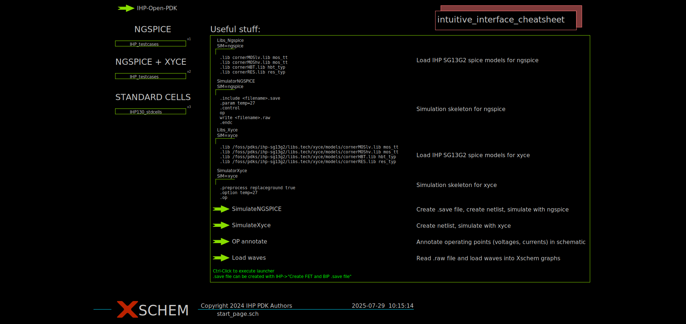
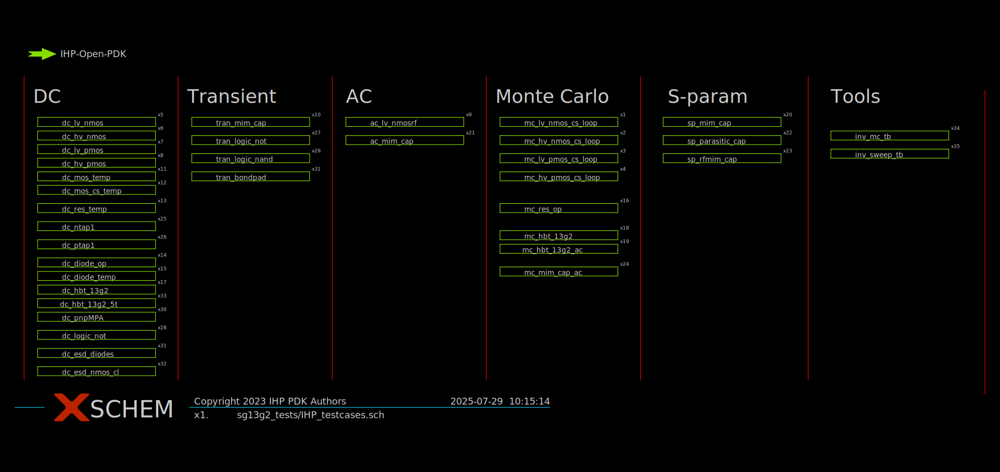
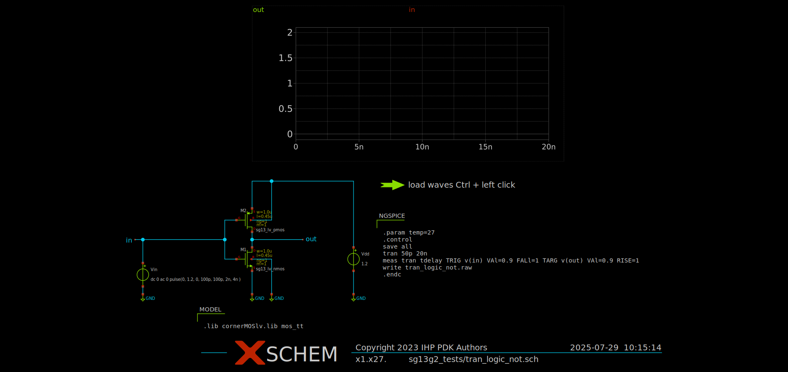
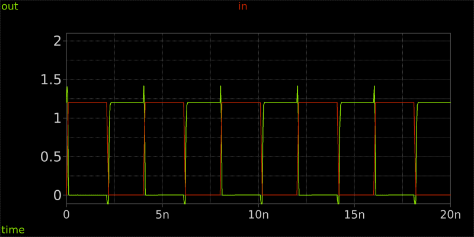

## Exploring the PDK Examples

The PDK (Process Design Kit) examples provide a set of pre-configured designs and simulations that can be used as a starting point for your own projects. These examples cover a wide range of use cases and demonstrate best practices for using the tools and libraries available in the PDK.

To explore them, simply open XSCHEM:
```bash
xschem
```

You should see this start page:

Here, you can see some useful commands and blocks which you can place into your own designs to the right. On the top right, you can access a cheatsheet of the controls available in XSCHEM.

We are interested in the examples to the left, those for ngspice to be exact. Jump into this sub-sheet by pressing `E` while hovering over the green rectangle (`IHP_testcases`) below `NGSPICE`.

You should see this sheet:

Here, you can explore various test cases and examples for different analysis types. You can once again enter each test case by pressing `E` while hovering over it. Leave a sub-sheet by pressing `Ctrl + E`.

## Simulating a Test Case - Inverter

We explore the `tran_logic_not` test case. This simulates a logic inverter using a transient analysis. Please enter it. You should see this sheet:


Let's just simulate the inverter first.

In order to do a simulation, we first need to generate the netlist. The netlist describes the device instances and their connections in the circuit. In XSCHEM, you can generate the netlist by clicking on the "Netlist" button in the toolbar.

After the netlist is generated, you can run the simulation by clicking on the "Simulate" button in the toolbar. This will open a new window, which is the interactive prompt for ngspice.

**Simulation Log**

You should see this log output:
```md

*************
** ngspice-44.2 Circuit level simulation program
** Compiled with KLU Direct Linear Solver
** The U. C. Berkeley CAD Group
** Copyright 1985-1994, Regents of the University of California.
** Copyright 2001-2024, The ngspice team.
** Please get your ngspice manual from https://ngspice.sourceforge.io/docs.html
** Please file your bug-reports at http://ngspice.sourceforge.net/bugrep.html
** Creation Date: Tue Jul 29 08:21:22 UTC 2025
********

Note: No compatibility mode selected!

Circuit: ** sch_path: /foss/pdks/ihp-sg1392/libs.tech/xschem/s91392_tests/tran_logic_not.sch

Doing analysis at TEMP = 27.000000 and TNOM = 27.000000 <!--(1)-->

Using SPARSE 1.3 as Direct Linear Solver

Initial Transient Solution
--------------------------

Node                                   Voltage
----                                   -------
in                                           0
net1                                       1.2
out                                        1.2
vdd#branch                        -2.67579e-10
vin#branch                         4.03724e-11

 Reference value: 1.21150e-08
No. of Data Rows : 465
tdelay              = 1.119817e-10 targ= 2.236982e-09 trig= 2.125000e-09
binary raw file "tran_logic_not.raw"
ngspice 1 ->
```
This output shows that the simulation was successful and provides information about the circuit being simulated.

This includes:

| Information Type | Command/Value                          | Description                                                                              |
| ---------------- | -------------------------------------- | ---------------------------------------------------------------------------------------- |
| Temperature      | `TEMP = 27.000000`                     | The temperature at which the simulation was run                                          |
| Initial solution | `Node` and `Voltage` columns           | The initial transient solution (values at each node at time t=0)                         |
| Data volume      | `No. of Data Rows : 465`               | The amount of data generated during the simulation                                       |
| Measurements     | `tdelay = 1.119817e-10`                | Measurement results (e.g., propagation delay `tdelay`, user-defined by `.meas` commands) |
| Output file      | `binary raw file "tran_logic_not.raw"` | The location of the binary raw file containing the simulation data                       |

**Graphs**

The simulation results in the resulting raw file can also be plotted. You can do this by using the waveform reload launcher (`load waves Ctrl + left click`).

This should load the traces into the plot in the schematic editor. It should look something like this:


We can see that the inverter is functioning as expected, with the output being the inverse of the input.

**Measurements/Analysis**

You can already do some analysis in ngspice directly via `.meas` commands. In the case of this simulation, we have this command:
```spice
meas tran tdelay TRIG v(in) VAl=0.9 FALl=1 TARG v(out) VAl=0.9 RISE=1
```
This measurement command measures the propagation delay (`tdelay`) of the inverter by triggering on the input voltage (`v(in)` at 0.9V falling edge) and targeting the output voltage (`v(out)` at 0.9V rising edge). From the log output, we can see that the measured propagation delay is 0.112 ns, where we triggered at the falling input edge at 2.125 ns and registered the output rising edge at 2.237 ns.

Later, we take a look on how to look at this raw data and perform more in-depth analysis on it in Python.

### Modifying component parameters

Staying inside this test case, we now want to see how the behaviour of the inverter changes depending on the transistor sizing. We can do this by modifying the width and length of the transistors in the inverter circuit.

In XSCHEM, you can easily modify component parameters by selecting the component (double click on component) and editing its properties in the property editor. For example, to change the width of a transistor, you can change the `w` parameter.

After making changes to the transistor sizes, you can regenerate the netlist and run the simulation again to see how the changes affect the inverter's performance.

### Modifying simulation parameters

To define the behaviour of the simulation, each top-level sheet should include simulation commands. They are placed in a code block like this (double click on it to edit):
```spice
name=NGSPICE only_toplevel=true
value="
.param temp=27
.control
save all 
tran 50p 20n
meas tran tdelay TRIG v(in) VAl=0.9 FALl=1 TARG v(out) VAl=0.9 RISE=1
write tran_logic_not.raw
.endc
"
```
Here, `name` simply specifies the title used for the code block, `only_toplevel` indicates that the commands should only be applied to the top-level sheet, and `value` contains the actual simulation commands to be executed. Let's take a closer look at the commands used in this example.
```spice
.param temp=27
.control
save all
tran 50p 20n
meas tran tdelay TRIG v(in) VAl=0.9 FALl=1 TARG v(out) VAl=0.9 RISE=1
write tran_logic_not.raw
.endc
```

| Command        | Purpose             | Description                                                                                                                            |
| -------------- | ------------------- | -------------------------------------------------------------------------------------------------------------------------------------- |
| `.param`       | Parameter setting   | Sets a simulation parameter (in this case, temperature)                                                                                |
| `.control`     | Command block start | Contains the simulation commands to be executed (**Note:** There are multiple ways to do this. We will just focus on this one for now) |
| `save all`     | Data collection     | Tells the simulator to save all node voltages and branch currents                                                                      |
| `tran 50p 20n` | Transient analysis  | Performs a transient analysis with a maximum time step of 50 ps and a total simulation time of 20 ns                                   |
| `meas`         | Measurement         | Measures the propagation delay of the inverter (as described above)                                                                    |
| `write`        | File output         | Saves the simulation results to a raw file                                                                                             |
| `.endc`        | Command block end   | Ends the control (`.control`) block                                                                                                    |

Now, if we want to modify the simulation parameters, we can do so by editing the code block accordingly. For example, we could change the temperature or the transient analysis time settings:
```spice
.param temp=10
.control
save all
tran 50p 10n
meas tran tdelay TRIG v(in) VAl=0.9 FALl=1 TARG v(out) VAl=0.9 RISE=1
write tran_logic_not.raw
.endc
```
Here, we simulate the inverter at 10 degrees Celsius with a total simulation time of 10 ns.