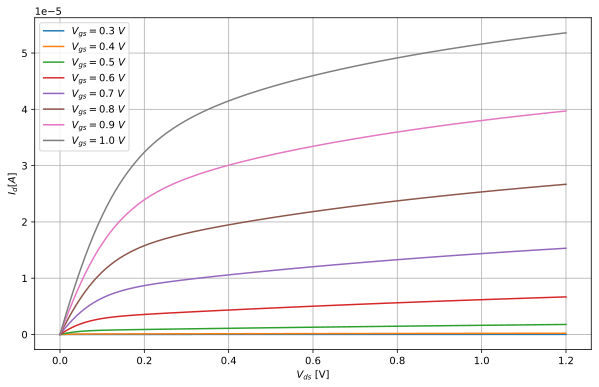
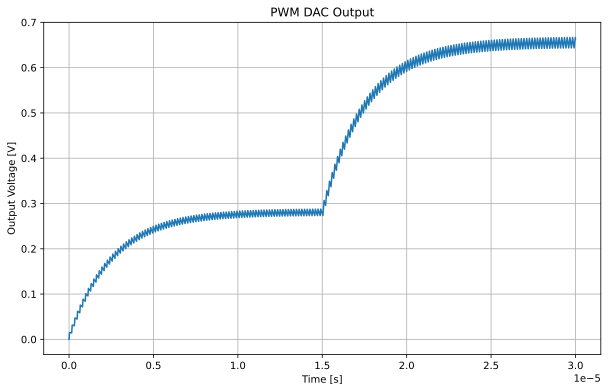

Sometimes, doing analysis of the simulation results can be cumbersome. To facilitate this, we can use Python scripts to process the raw data files generated by the simulations. This allows us to automate the analysis and generate plots or reports more easily.

## Reading `.raw` files

For reading in `.raw` files, multiple libraries exist. For me, it was easiest to use my own file parser:

??? quote "Custom Python `.raw` parser"
    ```py
    class NGSpiceRaw:
        def __init__(self, fname: str, live: bool = True):
            """
            Initialize the NGSpiceRaw object.

            Args:
                fname (str): The name of the .raw file to read.
                live (bool): Whether to reload the file on each access.
            """
            self.fname = fname
            self.live = live

            self._reload()

        def _reload(self):
            self.arrs, self.plots = self._read_raw(self.fname)
            self.plot, self.arr = self.plots[-1], self.arrs[-1]
            print(f"Loaded {len(self.plots)} plots from {self.fname}")

        def _read_raw(self, fname: str):
            """
            Read a binary ngspice .raw file.

            Returns:
              arrs  : list of numpy structured arrays, one per plot
              plots : list of metadata dicts, parallel to arrs
            """
            with open(fname, 'rb') as fp:
                arrs = []
                plots = []
                plot = {}
                while True:
                    line = fp.readline(BSIZE_SP)
                    if not line:
                        break
                    parts = line.split(b':', 1)
                    if len(parts) != 2:
                        continue
                    key, val = parts[0].lower(), parts[1].strip()
                    if key in MDATA_LIST:
                        plot[key] = val
                    if key == b'variables':
                        nvars   = int(plot[b'no. variables'])
                        npoints = int(plot[b'no. points'])
                        plot['varnames'] = []
                        plot['varunits'] = []
                        for _ in range(nvars):
                            ascii_line = fp.readline(BSIZE_SP).decode('ascii')
                            idx, name, *unit = ascii_line.split()
                            plot['varnames'].append(name)
                            plot['varunits'].append(unit[0])
                    if key == b'binary':
                        # build dtype (complex if flagged, else float)
                        fmt = np.complex_ if b'complex' in plot[b'flags'] else float
                        row_dtype = np.dtype({
                            'names':   plot['varnames'],
                            'formats': [fmt]*len(plot['varnames'])
                        })
                        # read data block
                        data = np.fromfile(fp, dtype=row_dtype, count=npoints)
                        arrs.append(data)
                        plots.append(plot.copy())
                        plot.clear()
                        fp.readline()

            return arrs, plots
        
        def select(self, idx: int):
            """
            Select a plot by index.
            """
            if idx < -len(self.plots) or idx >= len(self.plots):
                raise IndexError("Index out of range")
            
            self.plot = self.plots[idx]
            self.arr = self.arrs[idx]

            return self.plot, self.arr
        
        @property
        def names(self):
            return self.arr.dtype.names
        
        def __getitem__(self, key):
            """
            Get a variable by name or index.
            """
            if self.live:
                self._reload()

            if key in self.names:
                return self.arr[key]
            else:
                raise KeyError(f"Variable '{key}' not found")
            
        def __setitem__(self, key, value):
            """
            Set a variable by name or index.
            """
            if self.live:
                self._reload()

            if key in self.names:
                raise KeyError(f"Variable '{key}' already exists")
            else:
                # Add new variable to the array
                new_dtype = np.dtype(self.arr.dtype.descr + [(key, value.dtype)])
                new_arr = np.zeros(self.arr.shape, dtype=new_dtype)
                for name in self.names:
                    new_arr[name] = self.arr[name]
                new_arr[key] = value
                self.arr = new_arr
                self.arrs[-1] = new_arr
                self.plot['varnames'].append(key)
                self.plot['varunits'].append('')
                self.plot[b'no. variables'] = str(len(self.plot['varnames']))
                self.plot[b'no. points'] = str(len(self.arr))
    ```

This parser is quite easy to use:
```py
data = NGSpiceRaw("../simulations/dc_lv_nmos.raw", live=False) #(3)!
print("Fields:", data.names) #(1)!

v_ds = data["v(v-sweep)"] #(2)!
i_vd = data["i(vd)"]
v_th = data["v(@n.xm1.nsg13_lv_nmos[vth])"]
gm = data["@n.xm1.nsg13_lv_nmos[gm]"]
gds = data["@n.xm1.nsg13_lv_nmos[gds]"]
cgs = data["@n.xm1.nsg13_lv_nmos[cgsol]"]
cgd = data["@n.xm1.nsg13_lv_nmos[cgdol]"]
```

1.  This will print all the available traces
2.  Traces can be accessed directly via their names
3.  If live were to be True, the data would be loaded from the file every time a trace is accessed

## Sweeps

I did not yet find out how to properly extract sweeps from the data. Here is the hacky workaround I have used:
```py
class Sweep:
    def __init__(self):
        self.values = np.array([])

    def linear(self, start: float, stop: float, step: float):
        self.values = np.arange(start, stop + step, step)

        return self

    def split(self, data: np.ndarray):
        if len(data) % len(self.values) != 0:
            raise ValueError("Data length is not divisible by n")
        return np.array(np.array_split(data, len(self.values)))

    def __getitem__(self, index: int):
        if index < 0 or index >= len(self.values):
            raise IndexError("Index out of range")
        return self.values[index]
```
Which can be used like
```py
vgs_sweep = Sweep().linear(0.0, 1.0, 0.1) #(1)!

v_ds = vgs_sweep.split(v_ds)[0] #(2)!
i_vd = vgs_sweep.split(i_vd)
v_th = vgs_sweep.split(v_th)
gm = vgs_sweep.split(gm)
gds = vgs_sweep.split(gds)
cgs = vgs_sweep.split(cgs)
cgd = vgs_sweep.split(cgd)
```

1.  The sweep we have here is $V_{gs}$ from 0 to 1V in 0.1V steps
2.  $V_{ds}$ will be the same every time since it's the second sweep parameter

## Plotting

To plot the resulting drain current of this sweep of a MOSFET, you would then do:
```py
plt.figure(figsize=(10, 6))

for i, (vgs, values_split) in enumerate(zip(vgs_sweep.values, i_vd)):
    plt.plot(v_ds, values_split, label=f"$V_{{gs}} = {vgs:.1f}\\ V$", linewidth=1.5)

plt.xlabel("$V_{ds}$ [V]")
plt.ylabel("$I_{d} [A]$")
plt.legend()
plt.grid(True)
plt.show()
```

Which results in the following plot:


<!-- ## Example: Windowed FFT of our PWM DAC

To see the strengths of using Python in this simulation workflow, let's analyze the frequency content of our [PWM DAC](../cosimulation/design.md) signal using a windowed FFT.

I personally use a Jupyter Notebook to enable quick iterations.

First, we import the needed libraries:
```py
import matplotlib.pyplot as plt
import numpy as np

from common import NGSpiceRaw

%matplotlib widget
```
I have placed above `NGSpiceRaw` class into `common.py` to make it reusable across different notebooks. Also, I set the plotting backend to `widget` for interactive plots.

Then, we parse the raw data:
```py
data = NGSpiceRaw("simulations/pwm_dac_tb.raw")

data.names
```
This gives us the following names:
```py
('time', 'i(auto_dac3)', 'v(clk)', 'v(out)', 'v(rst)',
 'v(set0)', 'v(set1)', 'v(set2)', 'v(set3)', 'v(unfilt)',
 'i(v1)', 'i(v2)', 'i(v3)', 'i(v4)', 'i(v5)', 'i(v6)',
 'i(v7)', 'i(v8)', 'v(vdd)', 'v(vss)')
```
We are interested in the `time` and `v(out)` signals:
```py
time = data["time"]
out = data["v(out)"]
```
We just plot this directly:
```py
plt.figure(figsize=(10, 6))
plt.plot(time, out)
plt.xlabel("Time [s]")
plt.ylabel("Output Voltage [V]")
plt.title("PWM DAC Output")
plt.grid()
plt.show()
```
And get:
 -->